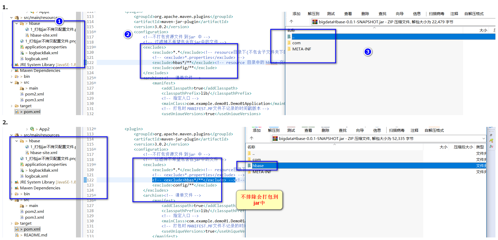

# bigdataStudy
bigdata学习


### 2 打包jar分离资源文件

#### 2.1 jar|maven-jar-plugin

`excludes中配置了文件夹，才会忽略resource中指定文件夹下面的内容。否则打包的jar还会包含 `

```xml
<!--打包jar -->
<plugin>
	<groupId>org.apache.maven.plugins</groupId>
	<artifactId>maven-jar-plugin</artifactId>
	<version>3.0.2</version>
	<configuration>
		<!--不打包资源文件 到jar 中 -->
		<!-- 过滤掉不希望包含在jar中的文件 -->
		<excludes>
			<exclude>*.*</exclude><!-- resource目录下(不包含子文件夹下的内容) 不会被拷贝到jar -->
			<!-- <exclude>*.properties</exclude> -->
			<exclude>hbas*/**</exclude><!-- resource 目录中的 hbase 文件夹等不会拷贝到jar -->
			<exclude>config/**</exclude>
		</excludes>
		<archive><!-- 清单文件 -->
			<manifest>
				<addClasspath>true</addClasspath>
				<classpathPrefix>lib/</classpathPrefix>
				<!-- 指定入口 -->
				<mainClass>com.example.demo01.Demo01Application</mainClass>
				<!-- 打包时 MANIFEST.MF文件不记录的时间戳版本 -->
				<useUniqueVersions>true</useUniqueVersions>
			</manifest>
			<manifestEntries><!-- 给清单文件添加键值对(配置文件外置) -->
				<Class-Path>config/</Class-Path>
			</manifestEntries>
		</archive>
	</configuration>
</plugin>
```



### getresource

mvn打包资源文件|https://www.jianshu.com/p/d44f713b1ec9

```

```


### 日志

 https://blog.csdn.net/wohaqiyi/article/details/81009689 


 [logback&lombok 简化日志处理]( https://blog.csdn.net/fjnpysh/article/details/73326856 )

 [《slf4j官方文档》传统桥接API](http://ju.outofmemory.cn/entry/254515)

 [从log4j日志无缝迁移至logback](https://www.cnblogs.com/huanghongbo/p/6026497.html) 

[logback最佳实践](https://www.jianshu.com/p/b3dedb8fb61e)

[log4j-over-slf4j工作原理详解](https://blog.csdn.net/john1337/article/details/76152906)
[log无法输出到文件](https://blog.csdn.net/gwlsky/article/details/72821396)


**使用logbak**

直接使用springstart

```xml
<dependency>
    <groupId>org.springframework.boot</groupId>
    <artifactId>spring-boot-starter-logging</artifactId>
    <version>2.2.1.RELEASE</version>
</dependency>
```

